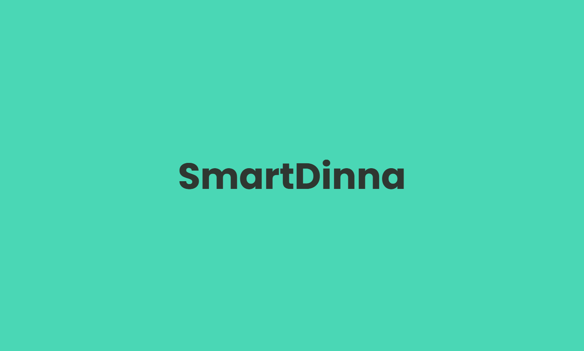

## Introduction

Smart Dinna is a AI powered chatbot web application that uses OpenAI's GPT-3 API to generate responses based on user prompts.

## Technologies 

-   Node.js
-   Vue.js
-   OpenAI API
-   Express
-   Nodemon
-   Cors
-   Dotenv

## License

Smart Dinna is licensed under the MIT license.
